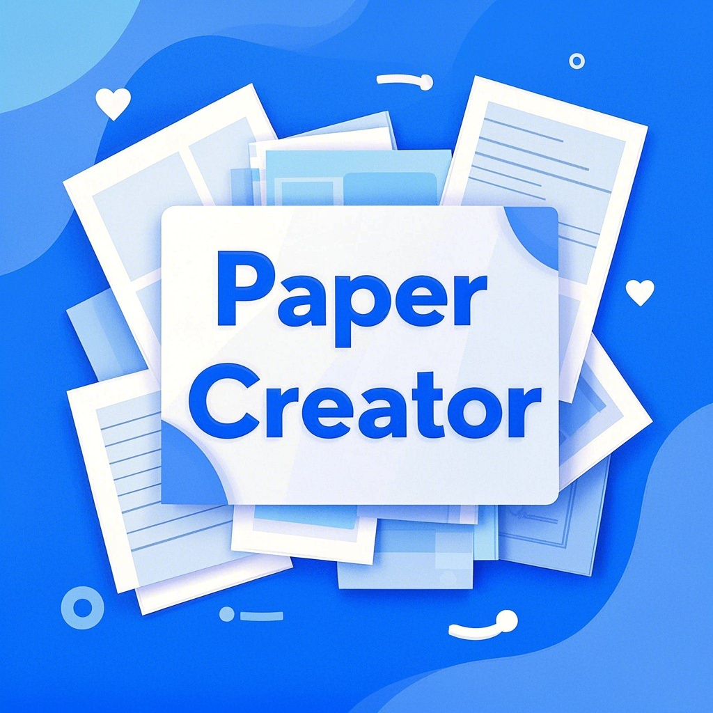

# PaperCreator-纸张生成器 
<div style="text-align:center;">
  

  [](https://github.com/Dangks/PaperCreator/actions/workflows/static.yml)

</div>

一个基于 HTML5 Canvas 的纸张生成工具，支持生成多种格式的纸张，如横线纸、方格纸、点阵纸和米字格等。用户可以自定义纸张尺寸、线条间距、线条粗细和颜色等参数，并可以导出为图片或 PDF 文件用于打印。

---


## 体验链接: [PaperCreator](https://dangks.github.io/PaperCreator/)

## 功能特性
- **纸张类型**：
  - 横线纸
  - 方格纸
  - 点阵纸
  - 米字格
  - 练字帖
- **自定义设置**：
  - 纸张尺寸（A4、A5、Letter）
  - 线条间距（单位：毫米）
  - 线条粗细（单位：像素）
  - 线条颜色
  - 线条样式（实线、虚线）
  - 纸张边距
  - 自定义水印
- **实时预览**：通过 Canvas 实时生成预览。
- **导出图片**：支持导出为 PNG 和 PDF 格式。


## 项目结构
```bash
PaperCreator/   
├── index.html  
├── src
│    ├─scripts  
│    │  ├── app.js  
│    │  └── jspdf.umd.min.js  
│    └─styles  
│       └── styles.css   
├── LICENSE  
└── README.md  
```


## 使用方法
1. 克隆项目到本地：
```bash
   git clone https://github.com/Dangks/PaperCreator.git
   cd PaperCreator    # 进入项目目录
```
2. 打开 index.html 文件，使用浏览器运行项目。
3. 在页面中选择纸张类型和设置参数，点击“生成纸张”按钮即可生成预览并导出打印


## 技术栈
- HTML5：页面结构
- CSS3：页面样式
- JavaScript：核心逻辑，基于 Canvas 绘制纸张


## 未来改进
- 增加更多纸张类型
- 支持导出更多格式
- 增加多语言支持


## 贡献
欢迎提交 Issue 或 Pull Request 来改进本项目！


## 许可证
本项目采用 [MIT License](LICENSE)。


## 致谢
本项目的开发过程中参考了以下资源和工具，在此表示感谢：
- [jsPDF](https://github.com/parallax/jsPDF)：用于实现 PDF 导出功能的开源库。
- HTML5 Canvas 文档和示例：为项目的绘图功能提供了技术支持。
- 开源社区的开发者们：提供了许多关于 Canvas 绘图和前端开发的优秀示例和灵感。  
此外，本项目的部分功能由AI 辅助完成。如果您发现本项目中引用了您的代码或资源，请随时联系我，我将补充相关的致谢信息。


## 效果预览


